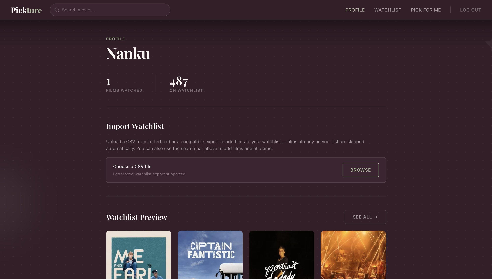
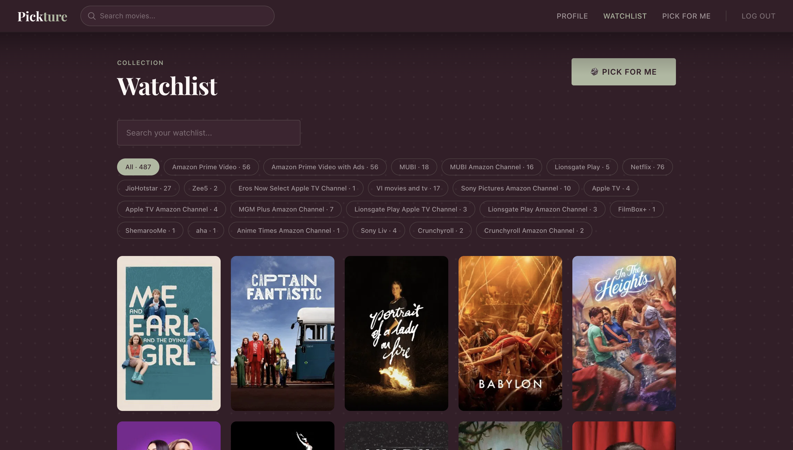
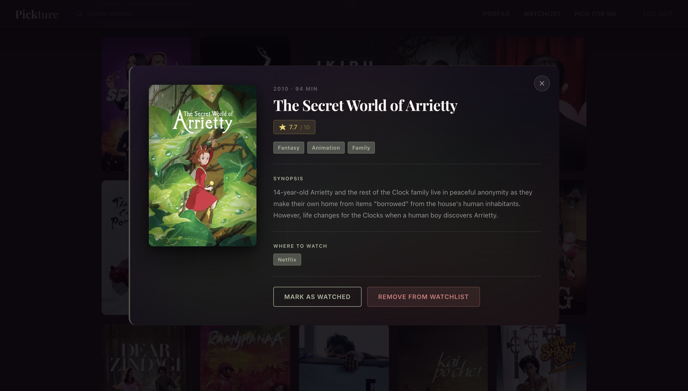
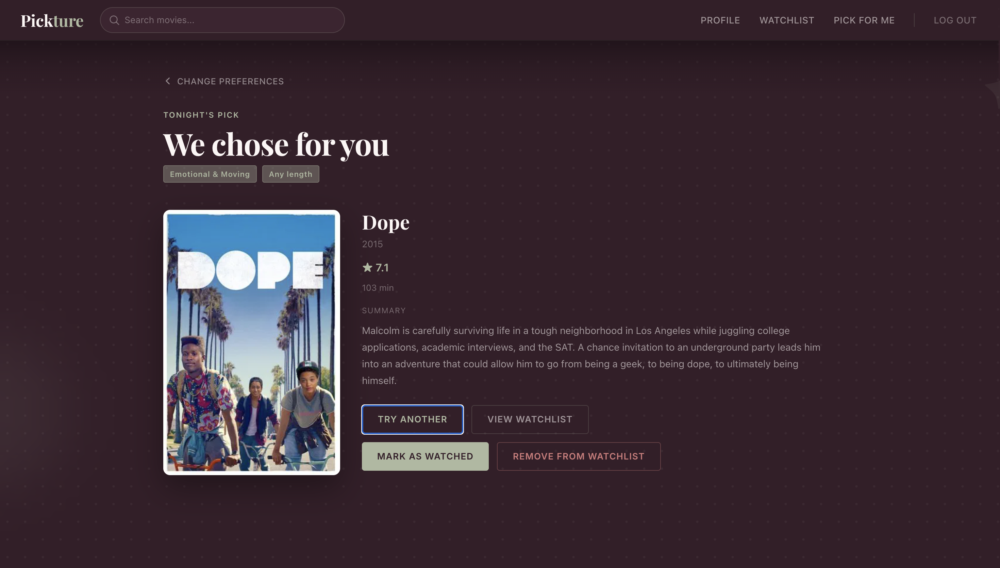

# Pickture

**Pick a film. Track your watchlist. Never think too much about what to watch again.**

Pickture is a Letterboxd-inspired movie companion built with React, Firebase, and the TMDB API. Import your watchlist, get personalized recommendations based on mood and time, and (soon) settle movie night with friends without the endless back-and-forth.

---

## Screenshots

| Profile | Watchlist |
|---|---|
|  |  |

| Movie Modal | Pick for Me |
|---|---|
|  |  |

---

## Current Features

### Authentication
Email-based sign up / log in via Firebase Auth. Each user gets their own document in Firestore that records their watchlist, watched history, and stats.

### Profile
- Concise Stats: films watched and films on watchlist.
- **Import from Letterboxd**: upload a CSV export and every entry is displayed in watchlist view with poster, rating, runtime, genres, synopsis, original language, and streaming availability via TMDB.
- Import is **duplicate-safe**: re-uploading a CSV only adds movies that aren't already on your watchlist, it never wipes or overwrites what's already there.
- A watchlist preview (first 4 posters, newest first) with a "See all" link through to the full watchlist.

### Search & Add (Navbar)
- A search bar is in the top nav on every page (once signed in).
- Debounced live search against TMDB as you type.
- Each result shows poster, title, and year with a one-click **+ Add** button.
- Movies already on your watchlist are automatically greyed out and marked "Added" i.e. no duplicates possible.
- Newly added movies appear at the **top** of your watchlist.

### Watchlist
- Full poster grid of every film you've added, newest first.
- **Search your watchlist** by title with a live text filter.
- **Filter by streaming provider** with pill-style toggles (auto-generated from your movies' actual availability i.e only the streaming providers that have films you want to watch are shown in the filter section).
- Click any poster to open a detail modal with synopsis, genres, rating, runtime, and where to watch.
- From the modal (or the recommendation screen), you can **mark a film as watched** or **remove it from your watchlist** - watched films count toward your stats.

### Pick for Me (Solo Quiz)
A quick four-question quiz: mood, runtime, language/region, and streaming service; pulls a matching film at random from your own watchlist.

### Recommendation Screen
- Shows the picked film with poster, rating, runtime, and providers.
- **Try Another**: reroll within the same filters.
- **Mark as Watched** / **Remove from Watchlist**: act on the recommendation directly without leaving the screen.

---

## Tech Stack

- **Frontend:** React, React Router
- **Backend / Auth / DB:** Firebase (Authentication + Firestore)
- **Movie Data:** [TMDB API](https://www.themoviedb.org/documentation/api)
- **CSV Parsing:** PapaParse
- **Styling:** Custom CSS: wine / sage / cream palette, Playfair Display + Inter (Letterboxd inspired)

---

## Project Structure

```
src/
├── api/
│   └── tmdb.js              # TMDB search, details, providers
├── components/
│   ├── Navbar.jsx            # Top nav + movie search/add
│   └── MovieModal.jsx  
├── assets/      # Shared movie detail popup
├── Pages/
│   ├── AuthScreen.jsx
│   ├── WelcomeScreen.jsx
│   ├── ProfileScreen.jsx
│   ├── WatchlistScreen.jsx
│   ├── SoloQuizScreen.jsx
│   ├── RecommendationScreen.jsx
│   └── ...                   # Room-based screens (see Roadmap)
├── utils/
│   └── watchlist.js          # Shared add/remove/mark-watched/search/dedupe logic
├── firebase.js
├── App.css
└── App.jsx

```

---

## Getting Started

1. **Clone the repo**
   ```bash
   git clone <your-repo-url>
   cd pickture
   ```

2. **Install dependencies**
   ```bash
   npm install
   ```

3. **Set up Firebase**
   Create a Firebase project with Authentication (Email/Password) and Firestore enabled, then drop your config into `src/firebase.js`.

4. **Add your TMDB API key**
   Grab a free key from [TMDB](https://www.themoviedb.org/settings/api) and set it in `src/api/tmdb.js`.

5. **Run the app**
   ```bash
   npm run dev
   ```

---

## Roadmap - Swiping Rooms

The next feature: turning movie night into a group decision instead of a monologue.

**How it'll work:**

1. **Create a room.** One person spins up a temporary room and gets a shareable room code.
2. **Friends join.** Anyone with the code can hop into the waiting room from their own device
3. **Everyone answers a quick quiz.** Mood, runtime, genre preferences (same spirit as the existing Solo Quiz, but the answers are pooled across everyone in the room)
4. **A shared pool is generated.** Pickture builds a pool of candidate films (pulled from participants' watchlists and/or TMDB) that fits the group's combined answers.
5. **Everyone swipes.** Each person swipes yes/no on the pool independently, at their own pace, without seeing anyone else's choices.
6. **Unanimous matches win.** Once everyone's finished, Pickture surfaces the films everyone said yes to (ranked, with a clear "top pick")so the group lands on something without an argument.

This flow is already scaffolded in the codebase (`CreateRoomScreen`, `JoinRoomScreen`, `WaitingRoomScreen`, `QuizScreen`, `SwipeScreen`, `ResultsScreen`) but currently runs on local mock data. The remaining work is wiring it up to real-time Firestore rooms so answers, swipes, and matches sync live across everyone's devices.

**Other ideas on the horizon:**
- Real-time swipe sync via Firestore listeners instead of local state.
- Room expiry / cleanup after a session ends.
- Optional "majority match" mode for larger groups where full unanimity is unlikely.
- Shareable results ("we watched X together") and session history.

---

## Contributing

This is currently a personal/academic project, but suggestions and issues are welcome.
